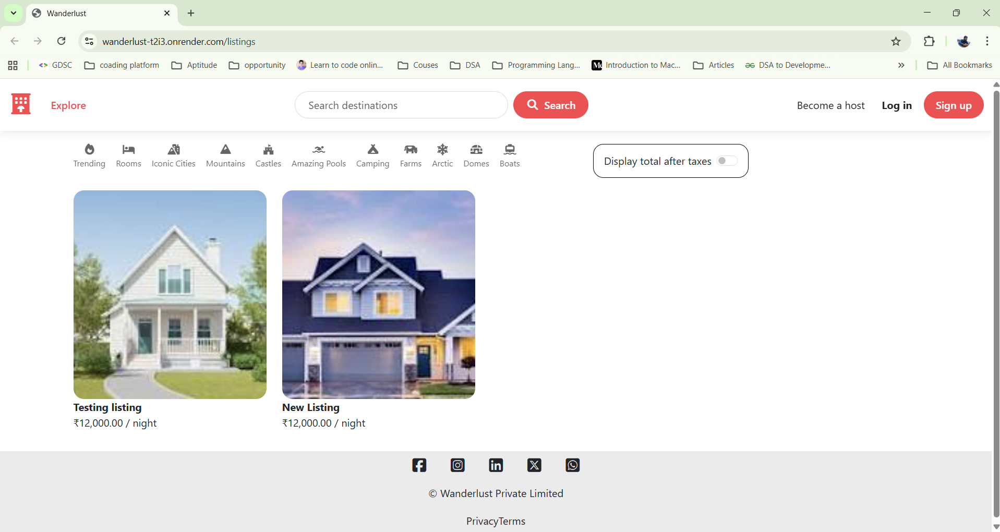

#  Major Project – Full Stack Web Application

This is a **full-stack web application** developed as part of a **Full Stack Web Development course**.  
The project demonstrates complete implementation of a modern web app — including authentication, database integration, image uploads, session handling, and cloud storage — using Node.js, Express.js, and MongoDB.

---

##  Features

-  **User Authentication & Authorization** using **Passport.js**
-  **Session Management** with `express-session` and `connect-mongo`
-  **Cloud-based Image Uploads** via **Cloudinary** and `multer-storage-cloudinary`
-  **Dynamic Templating** using **EJS** and `ejs-mate`
-  **Data Validation** with **Joi**
-  **Method Override** for PUT and DELETE operations
-  **Environment Variable Management** using **dotenv**
-  **MongoDB Integration** via **Mongoose**
-  **Flash Messages & Middleware-based Error Handling**
-  **Reusable Components & Modular Architecture** for scalability and maintainability

---

##  Tech Stack

**Frontend:**  
- HTML5, CSS3, EJS, Bootstrap/Tailwind CSS  

**Backend:**  
- Node.js, Express.js  

**Database:**  
- MongoDB (via Mongoose)  

**Authentication & Storage:**  
- Passport.js, Cloudinary, Multer  

**Other Tools:**  
- dotenv, Joi, Method-Override, Connect-Mongo  

---

##  Installation & Setup

1. **Clone the Repository**
   ```
   git clone https://github.com/OshankAgrawal/Major-Project.git
   cd Major-Project
   ```

2. **Install Dependencies**
    ```
    npm install
    ```

3. **Set Up Environment Variables**
    Create a .env file in the project root and add:
    ```
    CLOUDINARY_CLOUD_NAME=your_cloud_name
    CLOUDINARY_KEY=your_api_key
    CLOUDINARY_SECRET=your_api_secret
    MONGO_URL=your_mongodb_connection_string
    SESSION_SECRET=your_secret_key
    ```
4. **Run the Application**
    ```
    node app.js
    ```
    The app will typically run on `http://localhost:3000/`.

    ---

## **Folder Structure**
    ```
    major-project/
    │
    ├── models/          # Database models (Mongoose schemas)
    ├── routes/          # Express routes
    ├── views/           # EJS templates
    ├── public/          # Static files (CSS, JS, Images)
    ├── utils/           # Utility functions and middlewares
    ├── index.js         # Entry point
    ├── package.json
    └── .env.example     # Sample environment file

    ```

---

## **Key Highlights**

* Implemented MVC architecture for clean code separation.

* Used Cloudinary for efficient image handling and storage.

* Focused on reusability, modularity, and performance optimization.

* Built with a mindset for scalability and production deployment readiness.

---

## 📸 Screenshot


---

## 🏷️ Topics
`nodejs` `express` `mongodb` `ejs` `passportjs` `cloudinary` `fullstack` `web-development` `mvc` `authentication` `session-management` `multer` `dotenv`

---

## 📜 License
This project is licensed under the [MIT License](LICENSE) – feel free to use, modify, and share with credit.

---

## **Author**
**Oshank Agrawal** *Developer, Problem Solver, Tech Enthusiast* 🔗 [LinkedIn](https://www.linkedin.com/in/oshankagrawal/) • 📧 [E-Mail](mailto:oshankagrawal@gmail.com)
